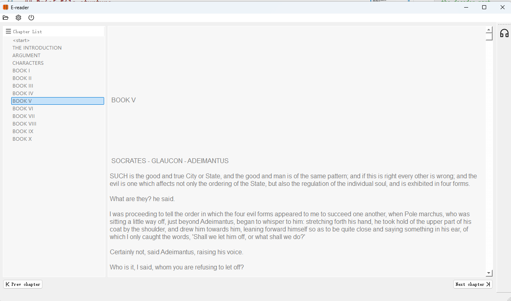
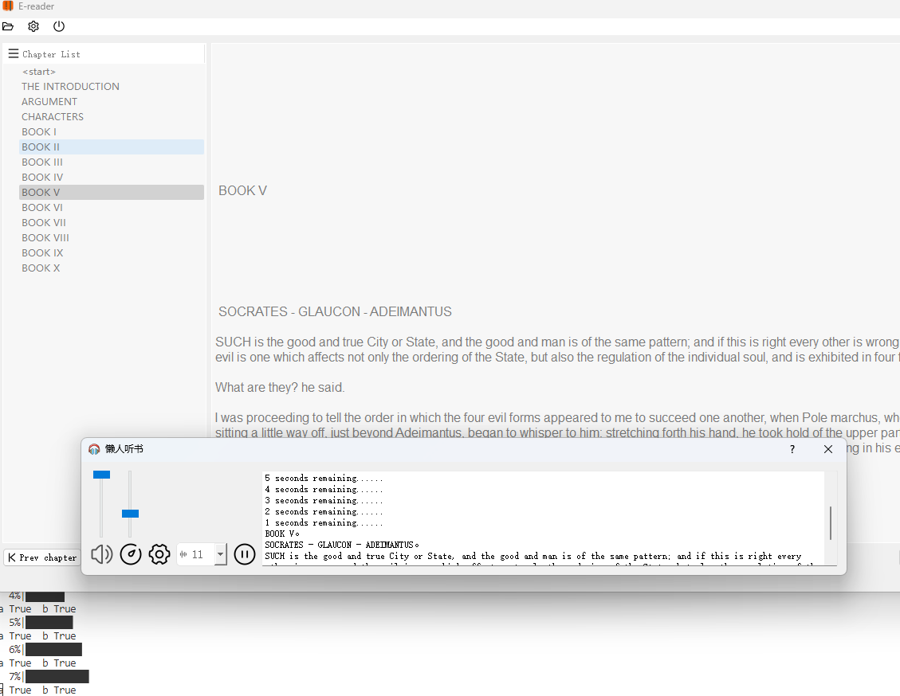

# TTS E-book Application on Ryzen AI


## Features

- Offline high quality text-to-speech via [GPT-SoVITS](https://github.com/RVC-Boss/GPT-SoVITS)
- exported to onnx and run though NPU with VitisAIExecutionProvider
- A handy e-book GUI that automatically read book

## Setup

First, create a new conda environment with python version 3.9.19

```
conda create -n tts python=3.9.19
conda activate tts
```

Install dependencies though a requirement file

```
pip install -r requirements.txt
```
(p.s. If there is error related to jieba_fast, then try to change jieba_fast to jieba)

Finally, setup Ryzen AI environment (make sure IPU is available though BIOS in advance)

```python
pip install ryzen-ai/voe-0.1.0-cp39-cp39-win_amd64.whl --force-reinstall
pip install ryzen-ai/onnxruntime_vitisai-1.15.1-cp39-cp39-win_amd64.whl --force-reinstall
pip install numpy==1.26.3 #force reinstall above packagees might install numpy==2.0.1
python ryzen-ai/installer.py
```

Download cache under the directory, which contains model weight though .pth(pytorch) and .onnx
```
https://1drv.ms/f/c/a4f8ec0d4b282111/EgdtNN4_jyVFgj9O8h-lwWcBElAVmezt9kWwpCCp_Bt8VQ?e=AeXFaG
```


## Brief File sturture

```python
TTS
├─cache
│  ├─ebooks     # some sample ebooks
│  ├─GPT_SoVITS # pytorch model weight
│  ├─onnx       # onnx model weight
│  │  └─gsv_2
│  └─tmp        # Ryzen AI compile cache
├─gpt_sovits
│  ├─GPT_SoVITS # code for gpt-sovits, mainly clone from the original repository
│  │  └─onnx_export_2.py    # export onnx model
│  ├─func_api.py            # run pytorch model
│  └─onnx_infer.py          # run onnx model (support both npu and cpu)
├─qtdesigner                # qt interface code
├─ryzen-ai                  # components of ryzen ai
│  ├─func_api.py            # run pytorch model
│  └─transformers
├─Service150                # A small utterance dataset
├─ebook_app.py              # Code for qt ebook reader GUI
├─quant_gpt_optimum.py      # Code for quantitizing the decoder part
├─tts_engine.py             # Code that wrap onnx_infer.py
├─tts_demo.ipynb            # Code for interacting with the tts engine
└─requirements.txt          # python dependencies
```


## How to use

### 1. Try out tts_demo.ipynb

This demo allow you to run the tts engine with cpu(Pytorch, Onnx) and npu.
Its better to make sure no issue occur them to move on to the application.


### 2. run ebook_app.py

Run
```
python ebook_app.py
```
And a simple but direct ebook reader interface will show up. Options on the up left allow user to adjust the font size, color, typeface and background image, as well as open new file. Currently the app only support `.txt` ad=nd `.epub` ebooks.

Clicking the button at top right open another window that read the book. Sliding bar at the right adjust reader's volumn and speed(however this is recommended to use before starting to read), and clicking the play button command the app to start reading. There are 10 seconds of preloading, because time on converting a text to speech is slightly shorter than reading it while running on cpu. This will allow the reader to read continuously in real-time.



In order to switch the backend or adjust speaker's voice id, change corresponding item in `qtdesigner/config.ini`


```ini
file: TTS/qtdesigner/config.ini

[DEFAULT]
file=
files=
chapter=0
font=SimSun
fontsize=9
color=255, 255, 255
bg=
screen=1280, 720
fontcolor=0, 0, 0

[FILE]
file=D:/workspace/TTS/cache/ebooks/The Republic by Plato (z-lib.org).epub
chapter=8
files=@Variant(\0\0\0\t\0\0\0\x1\0\0\0\n\0\0\0\x88\0\x44\0:\0/\0w\0o\0r\0k\0s\0p\0\x61\0\x63\0\x65\0/\0T\0T\0S\0/\0\x63\0\x61\0\x63\0h\0\x65\0/\0\x65\0\x62\0o\0o\0k\0s\0/\0T\0h\0\x65\0 \0R\0\x65\0p\0u\0\x62\0l\0i\0\x63\0 \0\x62\0y\0 \0P\0l\0\x61\0t\0o\0 \0(\0z\0-\0l\0i\0\x62\0.\0o\0r\0g\0)\0.\0\x65\0p\0u\0\x62)

[FONT]
font=Arial
fontsize=12
fontcolor=0, 0, 0

[BACKGROUND]
color=255, 255, 255
bg=

[SCREEN]
screen=1280, 720

[READ]
lines=

[TTS] #Change TTS parameters here!
lang=en
device=npu
voice=123

```

### 3. reproduce NPU complied file

First, run:
```
python gpt_sovits/GPT_SoVITS/onnx_export_2.py 
```
This export pytorch model to onnx.

Then, run quantitizing code
```
python python quant_gpt_optimum.py
```
This quantitize the autoregressive transformer in the TTS model to w8a8 (dynamical quantitize), making it possible to run on NPU.

## NPU Performance evaluation

Frankly speaking, TTS running on npu is 2~3 times slower than on cpu, since the NPU on Pheonix Point chip is relatively small. It can be expected that the TTS Ebook reader will be faster than CPU in the upcoming AMD chips. 